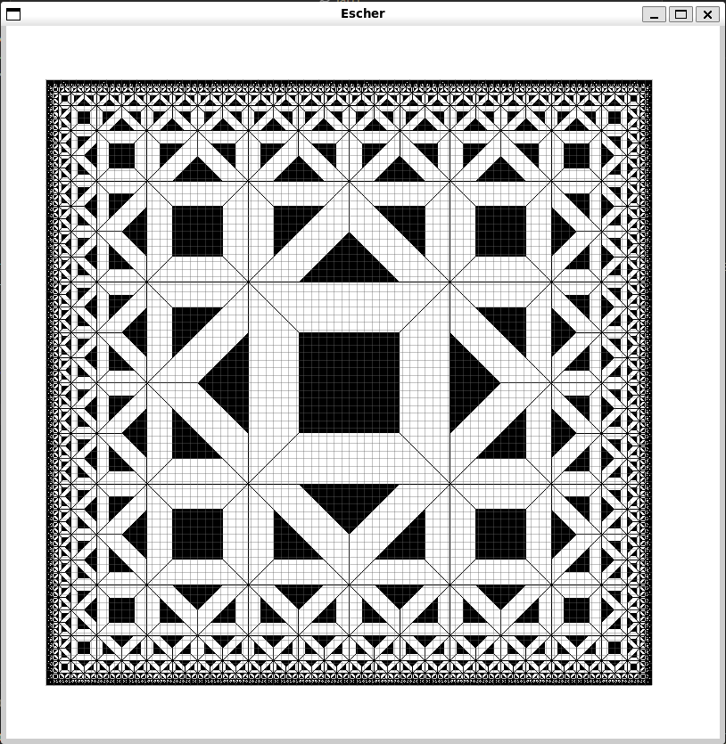

authors: Lallana Augusto, Pfaffen Ivo, Toledo Alejandro

# 2. Experiencia
Este laboratorio nos dió la oportunidad de profundizar en el desarrollo de programas usando el paradigma funcional. En materias de años pasados trabajamos en programas chicos y “auto contenidos” (alguna función para calcular Fibonacci o un recorrer árbol binario), y esta es nuestra primera experiencia en un entorno más complejo (involucrando librerías externas e I/O). 

Definir un lenguaje (e independizar la sintaxis de su interpretación - la semántica) nos permitió entender más a fondo tanto el proceso de desarrollo de programas funcionales como la creación de DSLs. 
Nos sorprendimos por la última figura que definimos y lo natural que resulta este paradigma para hacer este tipo de dibujos recursivos.

Entre las dificultades que tuvimos, destacamos tener que investigar sobre los contenidos de Gloss y utilizar las funciones y tipos que provee. También tuvimos que tomarnos un tiempo para terminar de comprender la funcionalidad (la interpretación) de las operaciones de nuestro lenguaje. 

# 3. Preguntas

#### 1. ¿Por qué están separadas las funcionalidades en los módulos indicados? Explicar detalladamente la responsabilidad de cada módulo.
- Módulo `Main.hs`:
Este módulo es el que se encarga de la interfaz con el usuario, utilizando una monada para hacer el I/O. IO representa acciones como valores, permitiendo manipularlos con funciones puras. Se importan los dibujos realizados en el laboratorio y se permite al usuario elegir qué dibujo mostrar.

- Módulo `Dibujo.hs`:
Con este módulo comenzamos a definir nuestro DSL (lenguaje de dominio específico). Se define la sintaxis de nuestro lenguaje, definiendo también nuestro tipo de dato recursivo y polimórfico `Dibujo`, junto a funciones que aplican sobre el mismo. Estas funciones se combinan para generar otros Dibujos. 

- Módulo `Interp.hs`:
En este módulo implementamos la semántica de nuestro lenguaje. Interpretamos geométricamente la sintaxis del lenguaje definido en `Dibujo.hs` utilizando la librería Gloss, de acuerdo al sistema vectorial indicado. 

- Módulo `Pred.hs`:
En este módulo implementamos predicados que podemos aplicar a nuestros dibujos para ver si las figuras básicas cumplen las propiedades solicitadas.

- Módulo `Dibujos/<Nombre>.hs` 
En este módulo se encuentran los dibujos que realizamos.
Separamos el uso del lenguaje de la implementación. Modularizamos cada dibujo, lo que nos permite importarlos individualmente al módulo principal (`Main.hs`) y separarlos de la definición o interpretación de nuestro lenguaje.

---
#### 2. ¿Por qué las figuras básicas no están incluidas en la definición del lenguaje, y en vez de eso, es un parámetro del tipo?

En nuestro lenguaje queremos la mayor flexibilidad posible. Por eso, a la hora de definir nuestra sintaxis a las figuras básicas las parametrizamos: son un parámetro del tipo `Dibujo`.
Las figuras básicas pueden variar de definición, las podemos definir con el tipo de dato que nos parezca indicado para el dibujo que querramos hacer. 

Por ejemplo, podemos tener figuras básicas del tipo de dato `Bool`, teniendo así 2 figuras básicas (`true` y `false`), que pueden interpretarse como un cuadrado negro o uno blanco. Podríamos también definirlas como números: teniendo figuras básicas del 0 al 100, si queremos agregar una figura básica más simplemente la definimos con 101.

---
#### 3. ¿Qué ventaja tiene utilizar una función de `fold` sobre hacer pattern-matching directo?

Al utilizar la función de alto orden `fold`, se colapsan los elementos de un tipo de dato específico. En nuestro caso (en el tipo de dato `Dibujo`), podemos modularizar la creación de funciones pasando como parámetro qué funciones queremos aplicar en cada caso. Ahí es donde reemplazamos el uso del pattern-matching.
Es una forma de aplicar recursión en nuestro tipo `Dibujo` aplicando las funciones específicas dependiendo el constructor, evitando tener que hacer pattern-matching en cada caso.

---
#### 4. ¿Cuál es la diferencia entre los predicados definidos en Pred.hs y los tests?
Los predicados definidos en `Pred.hs` son específicos a nuestra gramática. Nos permiten realizar operaciones lógicas sobre nuestro lenguaje. 
Los tests verifican la correctitud de las definiciones de las operaciones lógicas de nuestro lenguaje, definidas en `Pred.hs`. Es decir, comprobamos que la semántica realice lo esperado. 

# 4. Extras
En `Escher.hs` tenemos varias interpretaciones distintas para triángulo (ver la función `interpBasicaSinColor`). Según la implementación que se elija, la figura de Escher tendrá forma distinta. Nosotros dejamos descomentada la versión del triángulo rectángulo “decorado”: un triángulo rectángulo con una de sus esquinas pintada de negro.
 

