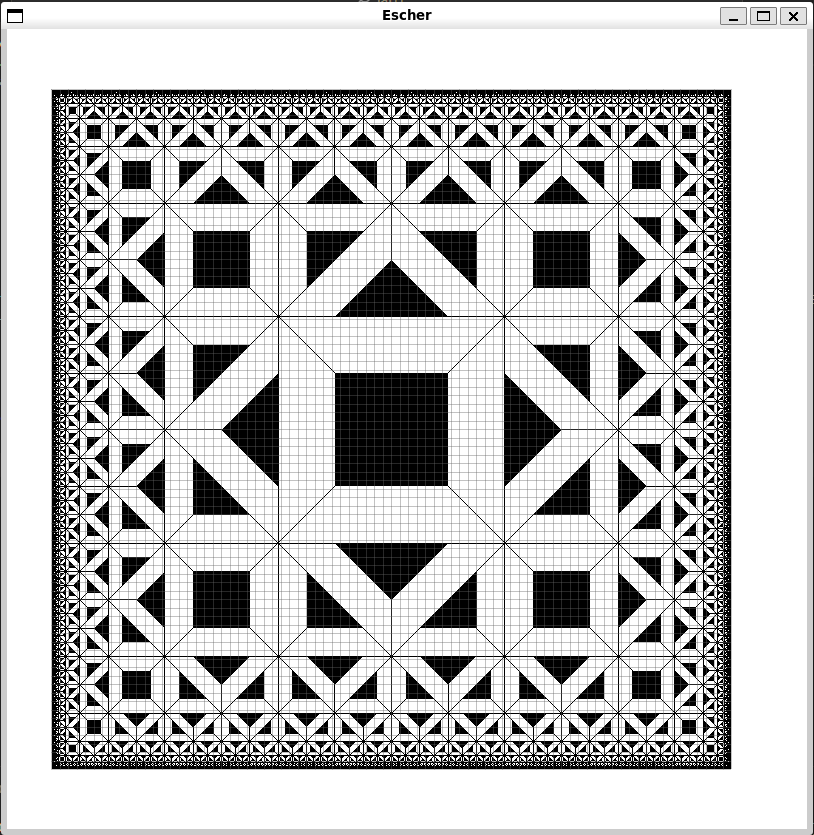

# Functional Geometry DSL

**Authors:** Augusto Lallana, Ivo Pfaffen, Alejandro Toledo

This project was developed as part of a university lab exercise focusing on functional programming paradigms. The goal was to design and implement a Domain-Specific Language (DSL) for geometric drawings using Haskell and the Gloss library. The project explores the separation of syntax and semantics, creating recursive and polymorphic data structures, and interpreting them visually.


## Draw your own figure
We include multiple example usages of the DSL under the `Dibujos/` directory.

The figure below demonstrates a 10-level Escher figure using the `Escher.hs` file:


To change the amount of levels you need to tweak the parameters under `escherConf` in the `Dibujos/Escher.hs` file:
```hs
escherConf :: Conf
escherConf = Conf {
    name = "Escher"
    , pic = escher 10 (Triangulo, Negro)
    , bas = interpBas
}
``` 

## Installation

The project is designed to run on Linux. For other operating systems, consider using a virtual machine with Linux.

### Linux (or macOS)
Run the following command in a terminal:
```bash
curl --proto '=https' --tlsv1.2 -sSf https://get-ghcup.haskell.org | sh
```

### Verifying Installation
To verify that Gloss is working, run:
```bash
cabal test gloss
```

## Project Structure

### Modules Overview
- **`Main.hs`**: Handles user interaction through an IO monad. It imports the drawings and allows users to select which drawing to display.
- **`Dibujo.hs`**: Defines the DSL syntax, including the recursive and polymorphic `Dibujo` data type and functions to generate and manipulate drawings.
- **`Interp.hs`**: Implements the semantics of the DSL. It interprets the syntax into geometric representations using the Gloss library.
- **`Pred.hs`**: Defines predicates to check properties of basic figures in the DSL.
- **`Dibujos/<Name>.hs`**: Contains individual drawings created with the DSL, separated for modularity.

### Design Choices and Details

#### Separation of Functionalities
The functionalities are split into modules to ensure clear separation of responsibilities:
- Syntax (`Dibujo.hs`): Focuses on the structure and combinatory rules of the DSL.
- Semantics (`Interp.hs`): Translates the structure into a visual output.
- User Interaction (`Main.hs`): Provides a clean interface for user input and output.

#### Parametric Basic Figures
The basic figures in the DSL are parameterized to allow flexibility in defining their properties. For instance, a basic figure could be a Boolean (`true` and `false` for black and white squares) or numerical values (e.g., 0-100).
